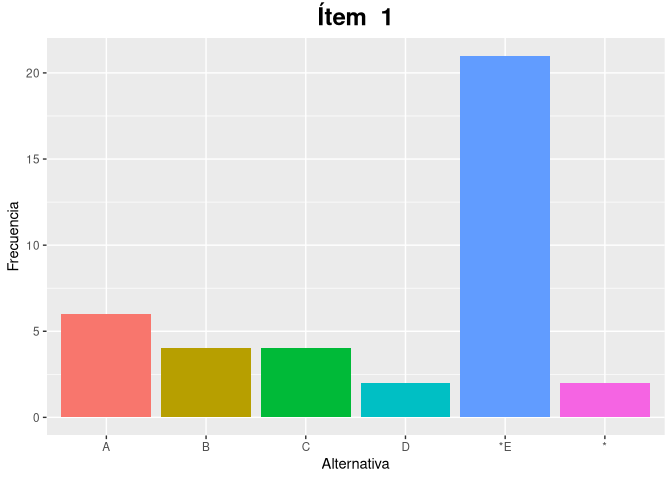
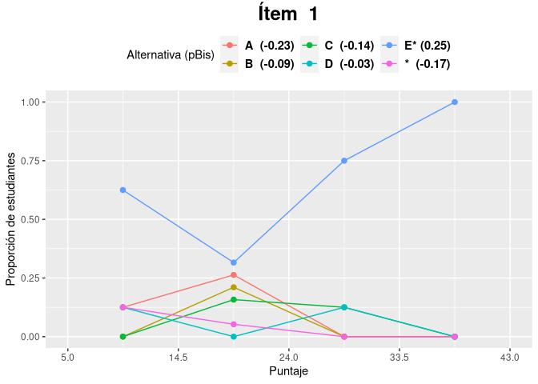

<!-- README.md is generated from README.Rmd. Please edit that file -->

# itan

<!-- badges: start -->
<!-- badges: end -->

El paquete itan tiene como finalidad ayudar a profesores a corregir,
calificar y analizar pruebas objetivas. Para ello, este paquete incluye
funciones que permiten calcular el puntaje y calificación obtenido por
estudiantes; así como también, funciones para analizar los ítems del
test. Entre estas últimas destaca el análisis gráfico de ítems que
permite visualizar las características técnicas del ítem y determinar
rápidamente su calidad.

## Instalación

Para instalar la versión de desarrollo del paquete itan desde
[GitHub](https://github.com/) con el siguiente comando:

``` r
# install.packages("devtools")
devtools::install_github("arielarmijo/itan")
```

## Ejemplo

El paquete itan incluye dos datos binarios de ejemplo llamados datos y
clave. Datos contiene las respuestas de 39 estudiantes a una prueba de
50 ítems y clave contiene las respuestas correctas a cada ítem.

``` r
library(itan)
head(datos)
#>          id i01 i02 i03 i04 i05 i06 i07 i08 i09 i10 i11 i12 i13 i14 i15 i16 i17
#> 1 200040629   E   D   C   B   A   C   C   D   E   B   E   A   C   A   D   C   B
#> 2 210047876   C   D   C   B   C   B   B   D   D   B   E   D   E   B   B   C   D
#> 3 210047897   E   D   C   B   A   C   B   D   E   C   D   A   E   B   D   C   C
#> 4 210040939   E   D   A   B   A   C   C   E   B   A   A   D   *   *   *   *   *
#> 5 200035827   *   *   *   *   *   *   *   *   B   C   D   A   C   *   *   *   *
#> 6 200039332   E   D   C   D   A   C   C   D   C   C   D   A   E   B   B   C   A
#>   i18 i19 i20 i21 i22 i23 i24 i25 i26 i27 i28 i29 i30 i31 i32 i33 i34 i35 i36
#> 1   E   B   C   E   B   E   E   E   E   E   B   A   A   C   C   B   C   A   C
#> 2   E   B   E   B   C   E   C   B   E   C   D   E   B   C   C   C   D   A   C
#> 3   E   B   E   D   D   E   D   E   D   E   B   A   D   E   C   A   C   A   E
#> 4   *   B   A   E   B   E   C   *   E   *   B   A   *   *   C   B   C   A   *
#> 5   *   *   *   *   *   *   *   *   *   A   A   A   B   C   C   B   C   A   C
#> 6   D   C   E   B   B   D   D   B   D   C   B   A   B   B   C   B   A   A   B
#>   i37 i38 i39 i40 i41 i42 i43 i44 i45 i46 i47 i48 i49 i50
#> 1   B   D   A   B   A   D   D   E   C   A   A   E   A   D
#> 2   E   C   A   D   D   B   C   E   C   A   C   D   C   C
#> 3   B   D   A   B   A   C   C   E   C   D   E   D   C   D
#> 4   B   C   A   B   A   D   C   E   C   *   C   E   A   D
#> 5   B   C   A   B   A   B   C   D   D   D   *   *   *   *
#> 6   C   D   A   C   D   D   A   C   D   B   B   B   B   D
clave
#>   i01 i02 i03 i04 i05 i06 i07 i08 i09 i10 i11 i12 i13 i14 i15 i16 i17 i18 i19
#> 1   E   D   C   B   A   C   C   E   B   C   D   A   C   A   D   C   B   E   B
#>   i20 i21 i22 i23 i24 i25 i26 i27 i28 i29 i30 i31 i32 i33 i34 i35 i36 i37 i38
#> 1   C   E   B   A   C   E   D   E   A   A   D   C   C   B   C   A   C   B   C
#>   i39 i40 i41 i42 i43 i44 i45 i46 i47 i48 i49 i50
#> 1   A   B   A   D   C   E   C   D   C   E   A   D
```

Para calcular el puntaje alcanzado en la prueba y su respectiva
calificación puede usarse el siguiente script:

``` r
respuestas <- datos[,-1]
respuestasCorregidas <- corregirRespuestas(respuestas, clave)
puntaje <- calcularPuntajes(respuestasCorregidas)
nota <- calcularNotas(puntaje)
head(cbind(id=datos$id, respuestasCorregidas, puntaje, nota))
#>          id i01 i02 i03 i04 i05 i06 i07 i08 i09 i10 i11 i12 i13 i14 i15 i16 i17
#> 1 200040629   1   1   1   1   1   1   1   0   0   0   0   1   1   1   1   1   1
#> 2 210047876   0   1   1   1   0   0   0   0   0   0   0   0   0   0   0   1   0
#> 3 210047897   1   1   1   1   1   1   0   0   0   1   1   1   0   0   1   1   0
#> 4 210040939   1   1   0   1   1   1   1   1   1   0   0   0   0   0   0   0   0
#> 5 200035827   0   0   0   0   0   0   0   0   1   1   1   1   1   0   0   0   0
#> 6 200039332   1   1   1   0   1   1   1   0   0   1   1   1   0   0   0   1   0
#>   i18 i19 i20 i21 i22 i23 i24 i25 i26 i27 i28 i29 i30 i31 i32 i33 i34 i35 i36
#> 1   1   1   1   1   1   0   0   1   0   1   0   1   0   1   1   1   1   1   1
#> 2   1   1   0   0   0   0   1   0   0   0   0   0   0   1   1   0   0   1   1
#> 3   1   1   0   0   0   0   0   1   1   1   0   1   1   0   1   0   1   1   0
#> 4   0   1   0   1   1   0   1   0   0   0   0   1   0   0   1   1   1   1   0
#> 5   0   0   0   0   0   0   0   0   0   0   1   1   0   1   1   1   1   1   1
#> 6   0   0   0   0   1   0   0   0   1   0   0   1   0   0   1   1   0   1   0
#>   i37 i38 i39 i40 i41 i42 i43 i44 i45 i46 i47 i48 i49 i50 puntaje nota
#> 1   1   0   1   1   1   1   0   1   1   0   0   1   1   1      37  6.0
#> 2   0   1   1   0   0   0   1   1   1   0   1   0   0   0      17  3.0
#> 3   1   0   1   1   1   0   1   1   1   1   0   0   0   1      30  4.7
#> 4   1   1   1   1   1   1   1   1   1   0   1   1   1   1      30  4.7
#> 5   1   1   1   1   1   0   1   0   0   1   0   0   0   0      20  3.3
#> 6   0   0   1   0   0   1   0   0   0   0   0   0   0   1      19  3.2
```

Además de calcular el puntaje y calificación, es posible analizar los
ítems de la prueba. Para calcular el índice de dificultad y los índices
de discriminación de cada ítem se puede ejecutar las siguientes líneas
de código:

    #>        p  dc1  dc2
    #> i01 0.75  0.3 0.60
    #> i02 0.95 -0.1 0.47
    #> i03 0.60  0.0 0.50
    #> i04 0.60  0.6 0.75
    #> i05 0.55  0.7 0.82
    #> i06 0.70  0.2 0.57

Otra manera de analizar la discriminación de un ítem es usando el
coeficiente de correlación biserial puntual:

``` r
alternativas <- c(LETTERS[1:5], "*")
biserial <- pBis(respuestas, clave, alternativas)
head(biserial)
#>   item     A     B     C     D     E     * KEY
#> 1  i01 -0.23 -0.09 -0.14 -0.03  0.25 -0.17   E
#> 2  i02   NaN -0.10  0.09 -0.10   NaN -0.05   D
#> 3  i03  0.02 -0.15 -0.05 -0.12   NaN  0.10   C
#> 4  i04 -0.34  0.34   NaN -0.13 -0.16 -0.05   B
#> 5  i05  0.55 -0.36 -0.39   NaN -0.12 -0.05   A
#> 6  i06 -0.19  0.01  0.16 -0.17 -0.10 -0.17   C
```

La frecuencia en que se eligió cada alternativa en cada ítem puede
hacerse de forma numérica o gráfica:

``` r
fa <- calcularFrecuenciaAlternativas(respuestas, alternativas, clave, frecuencia = FALSE)
head(fa)
#>   item  A  B  C  D  E * KEY
#> 1  i01  6  4  4  2 21 2   E
#> 2  i02  0  1  4 33  0 1   D
#> 3  i03  6  4 26  1  0 2   C
#> 4  i04 13 22  0  2  1 1   B
#> 5  i05 17  8  6  0  7 1   A
#> 6  i06  2  6 25  3  1 2   C
```

``` r
gfa <- graficarFrecuenciaAlternativas(respuestas, alternativas, clave)
gfa$i01
```



El paquete itan también implementa el análisis gráfico de ítems que
permite resumir las características técnicas del ítem de manera gráfica,
lo que facilita su análisis:

``` r
item <- agi(respuestas, clave, alternativas)
item$i01$plot
```



Revisar la documentación del paquete para ver más detalles de las
funciones anteriormente señaladas.
